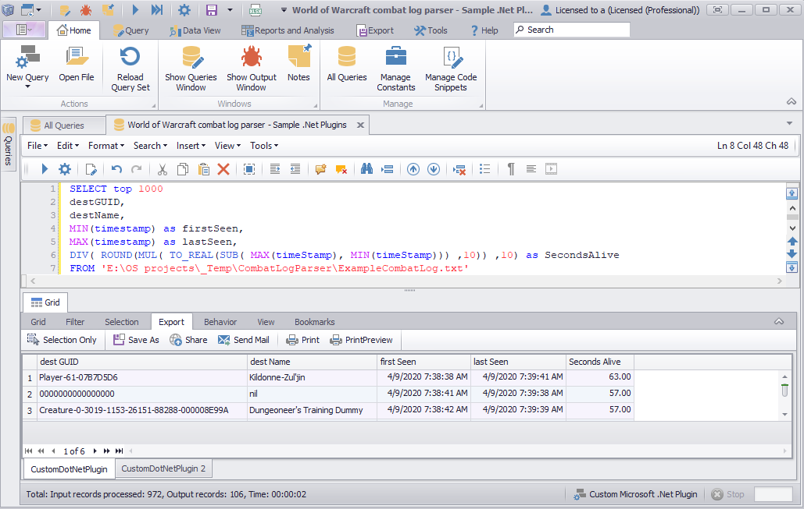

# World of Warcraft (WoW) combat log parser, reader, analyzer
## A Log Parser Lizard plugin for parsing the World of Warcraft combat log to a tabular data

The world of warcraft combat log is a line-separated file containing information about combat related events that occur in the game. This plugin was inpspired by this redit:

https://www.reddit.com/r/CompetitiveWoW/comments/48z0gl/quick_access_to_any_data_from_your_combat_log/

> From the post
>
> "...Why would anyone want to go digging through their combatlog file instead of just using WarcraftLogs or any other combat log analysis website? Here's an example. During my guild's mythic archimonde progression, I was interested in seeing "Time Alive" statistics for Infernal Doombringers - how many seconds did it take us to kill them once they spawned? Were we improving from raid night to raid night? I could get the data from WarcraftLogs, but it wasn't easy, and was pretty time-consuming....

The code provided was refactored to VB.NET syntax for Log Parser Lizard plugin architecture. Log Parser Lizard allows you to query data using SQL-like syntax from varius input formats and can be downloaded here: http://lizard-labs.com/log_parser_lizard.aspx

## How to use the plugin with Log Parser Lizard:

1. Doanlwas and copy ***DotNetPlugin_WorldOfWarcraftReader.vb*** (the plugin source code) to MyDocuments\LogParserLizard\Plugins folder. You can review the code for more information.
2. Create new query of type: "Custom Microsoft .Net Plugin"
3. Set query properties to: 
	- ***SourceCodeFile: DotNetPlugin_WorldOfWarcraftReader.vb*** - path of the plugin source code. Path can be changed as you need.
	- ***DebugMode: OFF*** - turn on if you develop yor own plugin to not cache the code and recompile on each start.
	- ***SimpleMode: ON*** - since the source code does not conatins full class and namespaces, simple mode is ON
4. Write simple query to see if it works (replace the values with your own or download the data to a local file): 

```
SELECT TOP 100 * 
FROM 
'C:\Visual Studio Projects\Log-Parser-Lizard-Custom-Plugins\World of Warcraft combat log parser\ExampleCombatLog.txt'
```

Or more complex queries

```
SELECT top 1000
destGUID, 
destName, 
MIN(timestamp) as firstSeen, 
MAX(timestamp) as lastSeen, 
DIV( ROUND(MUL( TO_REAL(SUB( MAX(timeStamp), MIN(timeStamp))) ,10)) ,10) as SecondsAlive 
FROM 'E:\OS projects\_Temp\CombatLogParser\ExampleCombatLog.txt' 
-- WHERE destName = 'Dungeoneer's Training Dummy' 
GROUP BY destGUID, destName 
ORDER BY firstSeen ASC
```

Here is the result in Log Parser Lizard:



Note: I'm not a gamer so I don't know how to use the data. I want to see how the parser works for log file with millions of log lines so please share some sample logs if you can. Thank you. 
